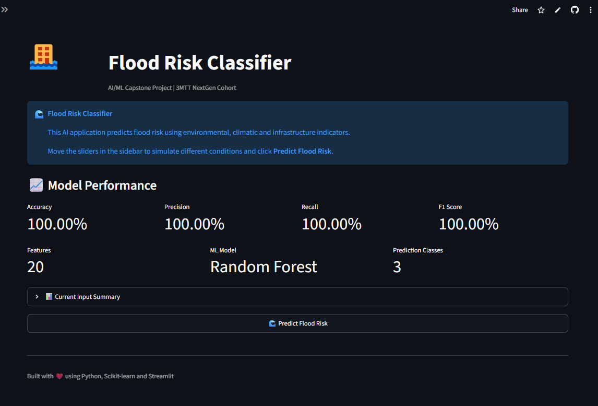
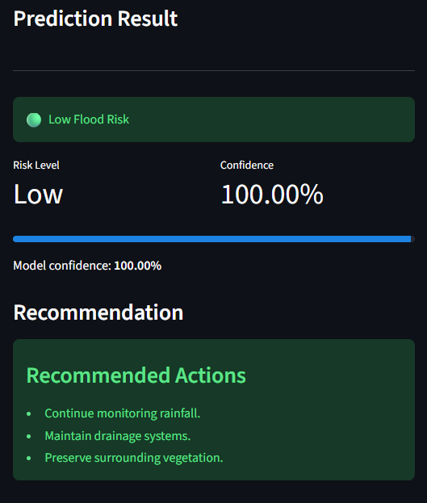
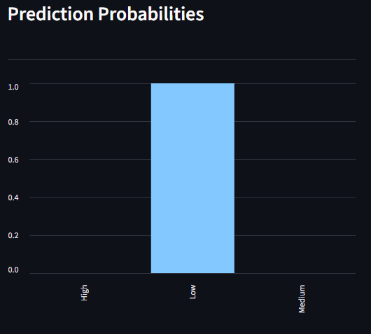
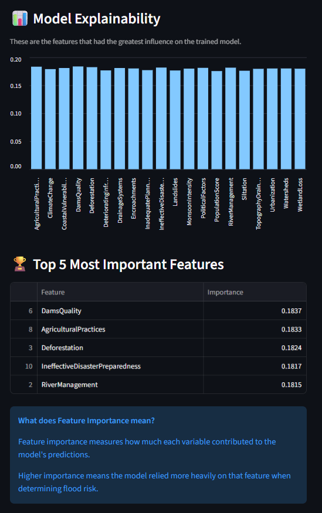

# 🌊 Flood Risk Classifier


An end-to-end Machine Learning application that predicts flood risk levels based on environmental and infrastructural factors using supervised learning algorithms and an interactive Streamlit web application.

---

# 🌐 Live Demo

🚀 **Try the application here**

**https://flood-risk-classifier-oxfemi.streamlit.app/**

No installation is required. Simply open the link and interact with the Flood Risk Classifier directly from your browser.

---

# 📌 Project Overview

Flooding is one of the most devastating natural disasters worldwide, causing loss of lives, destruction of infrastructure, and significant economic damage.

This project applies Machine Learning techniques to classify flood risk into three categories:

- 🟢 Low Risk
- 🟡 Medium Risk
- 🔴 High Risk

Users can adjust twenty environmental and infrastructure-related factors through an interactive Streamlit dashboard to instantly receive flood risk predictions, prediction confidence, probability distribution, and recommendations.

---

# ✨ Features

- 🌊 Predict Flood Risk (Low, Medium, High)
- 🤖 Compare Multiple Machine Learning Models
- 🏆 Automatic Best Model Selection
- 📊 Interactive Streamlit Dashboard
- 📈 Prediction Probability Visualization
- 🧠 Explainable AI using Feature Importance
- 🎛 Slider-Based User Interface
- 💡 Risk Recommendations
- 💾 Saved Trained Model using Joblib
- ☁ Deployed Online using Streamlit Community Cloud

---

# 🛠 Tech Stack

| Category             | Technology          |
| -------------------- | ------------------- |
| Programming Language | Python              |
| Machine Learning     | Scikit-learn        |
| Data Processing      | Pandas, NumPy       |
| Data Visualization   | Matplotlib, Seaborn |
| Model Persistence    | Joblib              |
| Web Framework        | Streamlit           |
| Environment Manager  | uv                  |
| Version Control      | Git & GitHub        |

---

# 🧠 Machine Learning Workflow

```text
Raw Dataset
      │
      ▼
Exploratory Data Analysis
      │
      ▼
Data Preprocessing
      │
      ▼
Flood Probability Classification
      │
      ▼
Train/Test Split
      │
      ▼
Feature Scaling
      │
      ▼
Train Multiple ML Models
      │
      ▼
Model Evaluation
      │
      ▼
Best Model Selection
      │
      ▼
Save Model Artifacts
      │
      ▼
Prediction Pipeline
      │
      ▼
Streamlit Web Application
```

---

# 🤖 Machine Learning Models

The following supervised learning algorithms were trained and compared:

- Logistic Regression
- Decision Tree Classifier
- Random Forest Classifier
- Gradient Boosting Classifier

Each model was evaluated using multiple performance metrics. The best-performing model was automatically selected and deployed.

---

# 📊 Dataset

The project uses a dataset containing:

- **50,000 observations**
- **20 input features**
- **1 target variable**

### Input Features

- Monsoon Intensity
- Topography Drainage
- River Management
- Deforestation
- Urbanization
- Climate Change
- Dams Quality
- Siltation
- Agricultural Practices
- Encroachments
- Ineffective Disaster Preparedness
- Drainage Systems
- Coastal Vulnerability
- Landslides
- Watersheds
- Deteriorating Infrastructure
- Population Score
- Wetland Loss
- Inadequate Planning
- Political Factors

### Target Variable

Originally:

- FloodProbability (continuous value)

Converted into three classes:

| Class     | Description         |
| --------- | ------------------- |
| 🟢 Low    | Low Flood Risk      |
| 🟡 Medium | Moderate Flood Risk |
| 🔴 High   | High Flood Risk     |

---

# 📈 Model Evaluation

The trained models were evaluated using:

- Accuracy
- Precision
- Recall
- F1 Score
- Confusion Matrix
- Classification Report

The best-performing model was automatically saved and used for predictions in the deployed application.

---

# 🧠 Explainable AI

To improve model transparency, Feature Importance analysis was performed to identify the environmental and infrastructural factors that contribute most to flood risk prediction.

This enables users to better understand which variables have the greatest influence on the model's decisions.

---

# 📷 Application Preview

## Home Page



## Prediction Result



## Prediction Probabilities



## Feature Importance



---

# 📂 Project Structure

```text
flood-risk-classifier/
│
├── app.py
├── README.md
├── requirements.txt
├── pyproject.toml
├── uv.lock
│
├── data/
│   ├── raw/
│   └── processed/
│
├── models/
│   └── artifacts/
│
├── results/
│
├── src/
│   ├── config.py
│   ├── preprocess.py
│   ├── train.py
│   ├── predict.py
│   ├── explain.py
│   └── utils.py
│
└── tests/
```

---

# 🚀 Installation

Clone the repository

```bash
git clone https://github.com/Oxfemi/flood-risk-classifier.git
```

Move into the project directory

```bash
cd flood-risk-classifier
```

Install all dependencies

```bash
uv sync
```

Run the training pipeline

```bash
uv run python -m src.train
```

Launch the Streamlit application

```bash
uv run python -m streamlit run app.py
```

---

# 🎯 How to Use

1. Open the deployed application.
2. Adjust the sliders representing environmental and infrastructural factors.
3. Click **Predict Flood Risk**.
4. View:
   - Predicted Flood Risk
   - Prediction Confidence
   - Probability Distribution
   - Risk Recommendation

---

# 💡 Future Improvements

Future versions of this project could include:

- 🌦 Real-time Weather API Integration
- 🛰 Satellite Image Analysis
- 🗺 GIS Mapping
- 📍 Location-Based Flood Prediction
- 📱 Mobile Application
- ☁ FastAPI Backend Deployment
- 🤖 Deep Learning Models
- 📊 Historical Flood Trend Analysis
- 🌍 IoT Sensor Integration
- ☁ Cloud Database Integration

---

# 🎓 Learning Outcomes

This project provided hands-on experience in:

- End-to-End Machine Learning Development
- Data Preprocessing
- Feature Engineering
- Classification Algorithms
- Model Evaluation
- Explainable AI
- Model Deployment
- Streamlit Development
- Git & GitHub Workflow
- Python Project Structure

---

# 👨‍💻 Author

**Happy Odole**

Mechanical Engineering Student  
Federal University of Technology, Akure

GitHub: https://github.com/Oxfemi

---

# 🙏 Acknowledgements

This project was developed as a capstone submission for the **3MTT Airtel NextGen Cohort**.

Special thanks to the organizers, mentors, and the open-source community for providing the resources and tools that made this project possible.

---

# ⭐ If you found this project helpful

Please consider giving the repository a ⭐ on GitHub.
